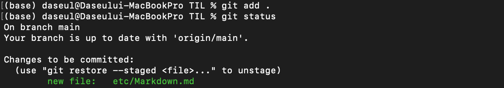
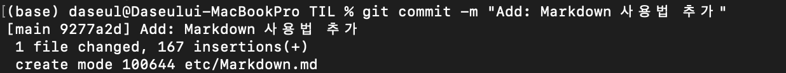
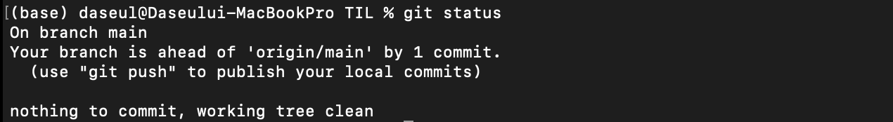
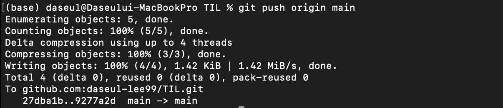

# Git

<br>


<br>

## 목차
[기본 설정](#기본-설정)

[SSH KEY 생성](#SSH-KEY-생성)

[로컬 저장소에 원격 저장소 가져오기](#로컬-저장소에-원격-저장소-가져오기)

[로컬 저장소에서 작업한 파일을 원격 저장소에 반영하기](#로컬-저장소에서-작업한-파일을-원격-저장소에-반영하기)

  - [Git Workflow](#git-workflow)
  
  - [commit message convention](#commit-message-conventeion)

[참고자료](#참고자료)

---
<br>

## 기본 설정
- 코드를 작성한 사람과 그 사람의 이메일을 알기 위한 설정

    ```
    git config --global user.name "name"
    git config --global user.email "email"
    ```

    

    - --global: 현재 PC 사용자(계정)에게 적용(전체 시스템 X)

---
<br>

## SSH KEY 생성
[자료 참조 - SSH 키 만들기](https://white-blank.tistory.com/8)

 - SSH(Secure SHell)란? 원격 호스트(여기서는 Git)에 접속하기 위해 사용되는 보안 프로토콜

   - 개인키(.pem)와 공개키(.pub)를 이용해 상대를 인증하고 통신

        > shell: 명령어와 프로그램을 실행할 때 사용하는 인터페이스. 커널과 사용자 간의 다리 역할. 사용자로부터 명령을 받아 그것을 해석하고 실행하는 역할

<br>

- Git 작업(push, pull, clone 등)을 위한 ssh key 생성
    - .ssh 디렉터리가 없어도 명령어(`ssh-keygen`) 실행하면 자동 생성
    - id_rsa: 개인키, id_rsa.pub: 공개키(GitHub에 등록)

        
        
        

<br>

## 로컬 저장소에 원격 저장소 가져오기

- git clone, remote
  - `git clone repo주소`: 원격 저장소의 repository를 로컬에 복사

    
    

  - `git remote -v`: repository에 설정된 alias(origin), alias가 연결된 repository 확인

    

  - `git remote add alias repo주소`: repository에 alias(test_alias) 설정
  - `git remote rm alias`: 설정된 alias 삭제

    

<br>

## 로컬 저장소에서 작업한 파일을 원격 저장소에 반영하기

- #### Git Workflow

  

  - **Working Directory**: 신규 파일 생성, 기존 파일 수정 등 현재 사용자가 작업 중인 로컬 디렉터리(pc 저장소)
  - **Staging Area**: commit 될 파일에 대한 정보를 가지고 있는 공간. `git add` 명령어를 통해 작업 파일을 working directory에서 staging area로 올림
    > staging area 장점 <br>
    > - 수정 파일이 많을 때 staging area를 통해 원하는 부분만 선택적으로 commit
    > - 일부 파일에만 merge 충돌이 있을 때, 충돌이 없는 파일만 선택적으로 commit (충돌 파일은 수정 후 다시 add, commit)
    > - staging area만 올리고 아직 commit하지 않은 파일을 재수정(파일 내용, commit message 등)
  - **Local Repository**: git이 관리하는 repository (보기엔 working directory와 동일). `git commit` 명령어를 통해 staging area의 내용을 local repository에 반영. 버전관리 O
  - **Remote Repository**: 여러 사용자와 공유할 수 있는 repository(원격 저장소). `git push` 명령어를 통해 local repository의 내용을 remote repository에 반영(GitHub에서 확인 가능)

<br>

- git add, commit, push
  - `git status`: ./etc/Markdown.md 파일 생성 후 현재 상태 확인

    

    - `Untracked files`: 신규 생성되어 Git에서 추적하지 못하는 파일(버전 관리 X)
    - 버전관리를 하고자하는 파일이면 add, commit, push를 통해 remote repository(원격저장소)에 반영해줘야 함

  - `git add 대상파일`: 새로운 파일/디렉터리를 staging area로 올리기. `.`은 변경이 있는 모든 파일
  
    

  - `git commit -m message`: staging area에 올라간 파일 local repository에 반영

    
    
    

     > #### commit message conventeion <br>
     > ```
     > type: subject
     > 
     > body
     > 
     > footer
     > ```
     > ```
     > Feat: 로그인 기능 구현
     > 
     > 구글, 카카오 로그인 구현
     > 
     > Resolves: #111
     > ```
     > - type: **feat**(기능 추가), **fix**(버그 수정), **docs**(문서 수정), **style**(코드 포맷팅 등 코드 변경이 없는 수정), **refactor**(코드 리팩토링), **test**(테스트 코드 추가), **chore**(빌드 업무/패키지 매니저 수정)
     > - subject: 수정 내용을 간략하게 서술
     > - body: 무엇을 왜 수정했는지 상세하게 서술
     > - footer: optional. 이슈 트래커 ID 작성(**유형: #번호**). **Fixes**(이슈 수정 중), **Resolves**(이슈 해결), **Ref**(참고할 이슈가 있을 때), **Related to**(관련 이슈 번호)

  - `git push 원격저장소명 브랜치명`: local repository(로컬 저장소) 내용을 remote repository(원격 저장소)에 반영
  
    

    - 원격저장소명은 `git remote`로 설정한 alias(default origin)

<br>

## 참고자료

- [SSH 명칭부터 접속까지 한 번에 이해하기](https://library.gabia.com/contents/infrahosting/9002/)
- [NeSI - Git: Reference Sheet](https://support.nesi.org.nz/hc/en-gb/articles/360001508515-Git-Reference-Sheet)
- [git 커밋 컨벤션 설정하기](https://velog.io/@shin6403/Git-git-%EC%BB%A4%EB%B0%8B-%EC%BB%A8%EB%B2%A4%EC%85%98-%EC%84%A4%EC%A0%95%ED%95%98%EA%B8%B0)